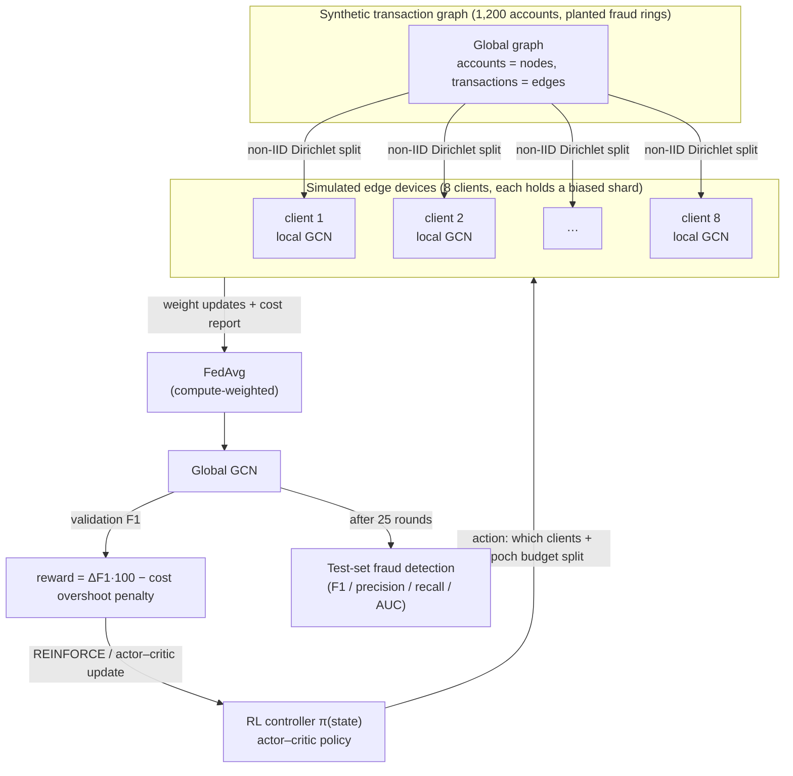

# FedGraph‑RL

**Can a reinforcement‑learned scheduler beat random client selection in
federated graph‑neural‑network fraud detection?**

A self‑contained research sandbox that fuses three machine‑learning paradigms into
one system — a **Graph Neural Network** fraud detector, trained by **Federated
Learning** across simulated edge devices, orchestrated by a **Reinforcement
Learning** controller that decides who trains each round and with how much
compute.

> **Headline result (5‑seed evaluation):** the learned controller **reliably beats
> a fixed training cohort (+0.11 F1, 5/5 seeds)** but lands in a **statistical
> dead heat with uniform‑random client selection** and with a simple
> fraud‑rate heuristic. This is a *negative result*, and a useful one: on this
> class of problem, random client sampling is a genuinely strong baseline — a
> finding that matches the federated‑learning literature.

Everything runs on **NumPy only** (no PyTorch/TensorFlow), CPU, in minutes.

---

## 1. Why this project exists (the need, in plain terms)

Banks and payment processors want to catch **fraud rings** — groups of accounts
that mostly transact with each other and a few "mule" bridges. That structure is
a *graph* problem: a Graph Neural Network (GNN) can see the ring; a model that
looks at each account in isolation cannot.

But the transaction data is **split across institutions** and cannot be pooled —
privacy law, competition, and plain data‑gravity keep it on separate servers.
**Federated Learning (FL)** is the standard answer: each institution trains the
shared model locally and sends back only model weights, never raw transactions.

FL has a practical knob that nobody agrees how to set: **each round, which
clients should participate, and how much local computation should each do?**
Picking all clients every round is expensive and can actually *hurt* accuracy
when their data distributions clash. Picking the "obvious" high‑fraud clients
overfits to them. The textbook default — **sample clients uniformly at random** —
is suspiciously hard to beat.

**FedGraph‑RL asks a narrow, testable question:** if we treat "who trains each
round" as a sequential decision problem and train a **Reinforcement Learning
(RL)** agent to make that choice — rewarded for global accuracy gains, penalised
for compute/communication cost — **does it beat the naive baselines?**

The answer this sandbox produces is: *it beats the bad baseline, it does not beat
the good baseline.* That is worth knowing before anyone builds a complex RL
scheduler into a real FL pipeline.

---

## 2. The idea: three paradigms, one loop



| Paradigm | Concrete role | Where in code |
|---|---|---|
| **Graph Neural Network** | 2‑layer GCN node classifier (fraud vs. legit). Message passing over the normalised adjacency lets it detect ring structure. Built on a ~150‑line hand‑written reverse‑mode autograd engine. | [`fedgraphrl/gnn.py`](fedgraphrl/gnn.py), [`fedgraphrl/autograd.py`](fedgraphrl/autograd.py) |
| **Federated Learning** | 8 clients each own a **non‑IID** shard of the graph (fraud rings concentrated on a few clients via a Dirichlet split). FedAvg aggregates weights; aggregation is **compute‑weighted** so the server trusts clients it invested more epochs in. | [`fedgraphrl/data.py`](fedgraphrl/data.py), [`fedgraphrl/federated.py`](fedgraphrl/federated.py) |
| **Reinforcement Learning** | Each federated round = one RL step. **State:** global progress + per‑client descriptors (rounds‑since‑selected, last local loss, shard fraud rate, shard size). **Action:** pick `k` clients (Plackett–Luce sample) and split a fixed epoch budget among them (softmax). **Reward:** ΔF1·100 − soft cost penalty. Trained with REINFORCE + multi‑rollout averaging, optionally with a learned value critic (actor–critic). | [`fedgraphrl/environment.py`](fedgraphrl/environment.py), [`fedgraphrl/rl_controller.py`](fedgraphrl/rl_controller.py) |

Full requirements and interfaces: [`docs/TRD.md`](docs/TRD.md).
Step‑by‑step workflow and diagrams: [`docs/WORKFLOW.md`](docs/WORKFLOW.md).
The reasoning behind every design choice, in order: [`docs/DESIGN_LOG.md`](docs/DESIGN_LOG.md).

---

## 3. Quick start

```bash
git clone <your-repo-url>
cd fedgraph-rl
python -m pip install -r requirements.txt

python tests/test_autograd.py          # finite-difference gradcheck + FL smoke test
python experiments/run_experiment.py   # one seed: RL vs baselines (~70 s)
python experiments/sweep.py 5          # 5-seed evaluation with mean ± std (~12 min)
```

Outputs land in `experiments/`:
`results.json` / `results.png` (single seed) and
`sweep_results.json` / `sweep_results.png` (multi‑seed).

All knobs live in [`fedgraphrl/config.py`](fedgraphrl/config.py).

---

## 4. Results

**Setup:** 1,200‑account graph, 12 fraud rings, 8 clients, non‑IID Dirichlet
α = 0.10, 25 federated rounds/episode, 100 actor–critic updates/seed,
4 rollouts averaged per update, decision threshold tuned on a validation split.
5 graph seeds. Numbers are **test‑set** fraud detection, mean ± std across seeds.

| Policy | F1 | AUC | Precision | Recall |
|---|---|---|---|---|
| **RL controller (actor–critic)** | **0.603 ± 0.154** | 0.839 ± 0.075 | 0.648 | 0.634 |
| Uniform‑random client selection | 0.620 ± 0.170 | 0.845 ± 0.077 | 0.646 | 0.715 |
| Fraud‑rate greedy (always pick high‑fraud shards) | 0.598 ± 0.137 | 0.805 ± 0.065 | 0.602 | 0.639 |
| Fixed cohort ("all" — same `k` clients every round) | 0.492 ± 0.170 | 0.744 ± 0.061 | 0.626 | 0.437 |
| Centralised upper bound (pool the graph, no FL) | 0.698 ± 0.122 | 0.921 ± 0.053 | 0.756 | 0.676 |

**Paired per‑seed comparison** (RL F1 − baseline F1, same graph seed):

| vs. baseline | mean Δ F1 | seeds RL wins |
|---|---|---|
| uniform‑random | −0.017 | 2 / 5 |
| fraud‑rate greedy | +0.005 | 1 / 5 |
| fixed cohort | **+0.111** | **5 / 5** |
| centralised upper bound | −0.095 | 1 / 5 |


### What the numbers say

1. **The RL controller works — against the weak baseline.** A fixed training
   cohort loses coverage of fraud rings it never sees; the learned policy rotates
   participation and beats it on every seed by a wide margin (+0.11 F1).
2. **It does not beat the strong baselines.** The gap to uniform‑random (−0.017)
   and to the fraud‑rate heuristic (+0.005) is an order of magnitude smaller than
   the cross‑seed noise (±0.15). This is a tie, not a win.
3. **It does not reach centralised training.** FL on this non‑IID split costs
   ~0.10 F1 versus pooling the data — an FL problem, not an orchestration problem.

### Why the RL win never materialised (and what we tried)

Every plausible lever was pulled — see [`docs/DESIGN_LOG.md`](docs/DESIGN_LOG.md)
for the full chronology. In brief:

| Attempt | Rationale | Outcome |
|---|---|---|
| Multi‑rollout gradient averaging | Cut REINFORCE variance | Smoother learning curve; final policy unchanged |
| Validation‑tuned decision threshold | Remove the fixed‑0.5 F1 artifact | Lifted *all* policies ~0.1 F1; ranking unchanged |
| Harder non‑IID (α 0.15 → 0.05) + higher cost penalty | Give the scheduler more to exploit | Made RL *worse* — cost term drowned the accuracy signal |
| Soft cost constraint (penalty only above a budget) | Let the agent optimise accuracy freely within budget | Fixed the reward damage; ranking still unchanged |
| α = 0.10 + 100 updates | Sweet‑spot non‑IID, more training | Variance rose (±0.09 → ±0.15); no win |
| Actor–critic (learned V(s) baseline) | The standard fix when a scalar baseline underperforms | **No measurable change** — rules out gradient variance as the bottleneck |

**Diagnosis:** at these settings the task has little exploitable structure for a
client‑*selection* policy. When a fraud ring lives almost entirely on one client
(measured: rings 75–100 % concentrated at α = 0.05), *when* you schedule that
client barely matters — you get the ring or you don't. "Sample everyone
eventually" (random) is close to optimal, so there is almost no headroom for a
learned scheduler to claim.

### When would RL be expected to win?

Not from more tuning — from a harder environment that rewards *timing*:
client stragglers and dropouts, a per‑round wall‑clock deadline, concept drift so
recently‑trained clients decay, or a communication budget tight enough that
"train everyone eventually" is infeasible. Those are the conditions under which
FL client selection is an open research problem; this sandbox is set up to add
them.

---

## 5. What's in the repository

```
fedgraph-rl/
├── fedgraphrl/                package (NumPy only)
│   ├── autograd.py            ~150-line reverse-mode autograd engine
│   ├── data.py                synthetic transaction graph, planted fraud rings, non-IID sharding
│   ├── gnn.py                 2-layer GCN node classifier + SGD
│   ├── federated.py           FederatedClient / FederatedServer / FedAvg / threshold tuning
│   ├── environment.py         FederatedEnv — federated orchestration as an RL environment
│   ├── rl_controller.py       PolicyNet, ValueNet, ReinforceController (+ actor-critic), HeuristicController
│   └── config.py              every hyper-parameter, one dataclass
├── experiments/
│   ├── run_experiment.py      single-seed: train controller, compare to baselines, plot
│   ├── sweep.py               multi-seed: mean ± std + paired comparison + plot
│   ├── results.json/.png      single-seed artifacts (committed)
│   └── sweep_results.json/.png  5-seed artifacts (committed)
├── tests/test_autograd.py     finite-difference gradient check + federated-round smoke test
├── docs/
│   ├── TRD.md                 Technical Requirements Document
│   ├── WORKFLOW.md            end-to-end workflow + mermaid flowcharts
│   └── DESIGN_LOG.md          every decision, why it was made, what it changed
├── LICENSE                    MIT
├── CITATION.cff
├── CHANGELOG.md
├── pyproject.toml
└── requirements.txt
```

---

## 6. Reproducibility

- Pure NumPy; deterministic given a seed (`numpy.random.default_rng`).
- `sweep.py` uses seeds `7, 107, 207, 307, 407` and reports every per‑seed number
  in `sweep_results.json`, not just the aggregate.
- The committed `*.png` / `*.json` in `experiments/` were produced by the exact
  config in [`fedgraphrl/config.py`](fedgraphrl/config.py) at tag `v0.1.0`.
- Runtime: single seed ≈ 70 s, 5‑seed sweep ≈ 12 min on a laptop CPU.

---

## 7. Status

**This repository is private.** It is a completed experiment write‑up, intended to
go public once reviewed. Before flipping it public:

- [ ] Confirm the licensing choice (currently MIT) and the copyright holder name.
- [ ] Decide whether to keep the large `*.png` artifacts in git or move to a release.
- [ ] Optional: add the "harder environment" variants described in §4 so the
      public version can show a *positive* RL result too.

Make it public with:

```bash
gh repo edit --visibility public --accept-visibility-change-consequences
```

---

## 8. License & citation

MIT — see [`LICENSE`](LICENSE). If you use this, please cite via
[`CITATION.cff`](CITATION.cff) (GitHub renders a "Cite this repository" button).

---

## 9. Disclaimer

The data is **synthetic**. This is a methods sandbox, not a production
fraud‑detection system and not financial or compliance advice. The GNN, the FL
setup, and the RL controller are all deliberately small so the whole pipeline is
readable and fast, not so they are state of the art.
