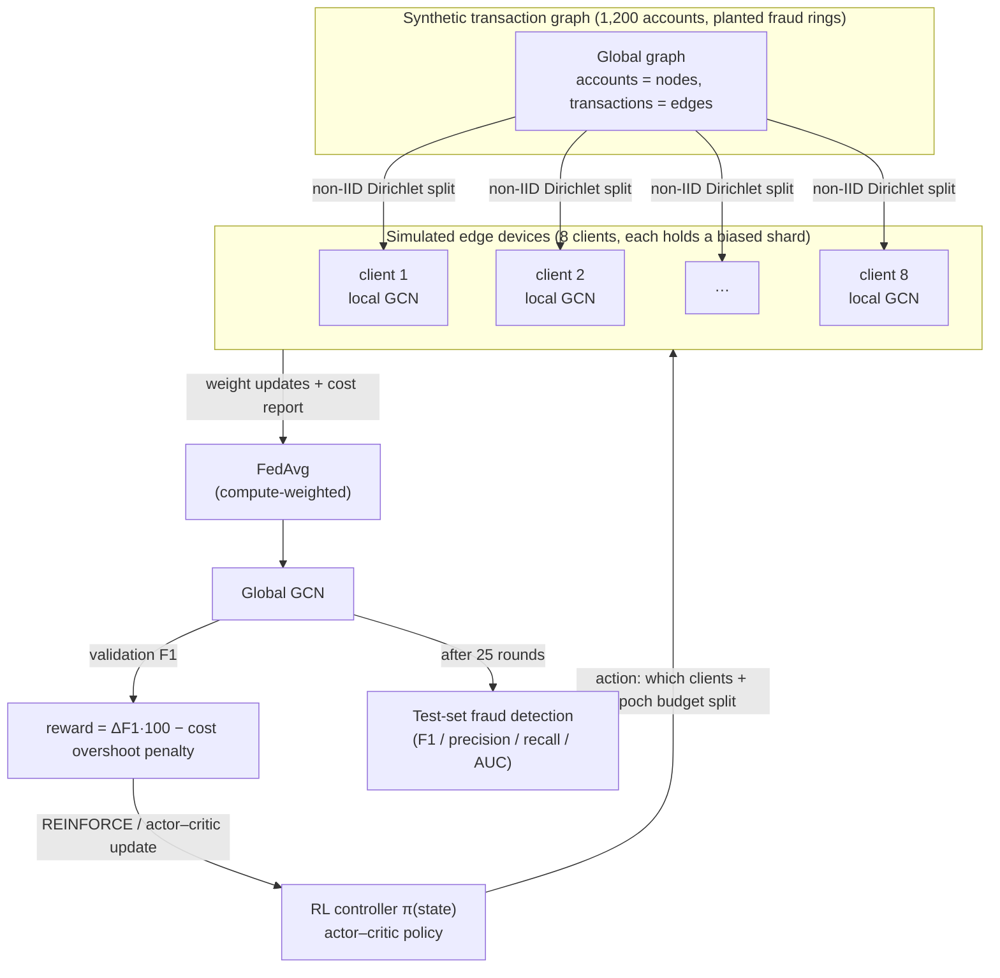
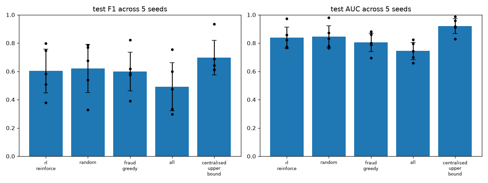
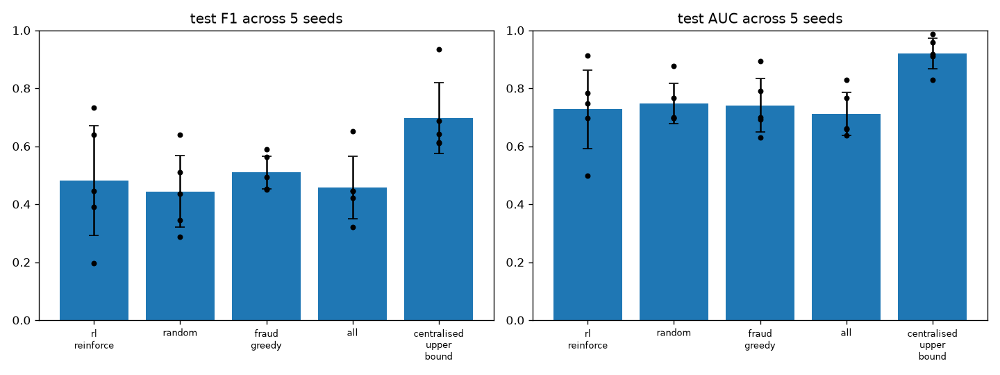

# FedGraph‑RL

**Can a reinforcement‑learned scheduler beat random client selection in
federated graph‑neural‑network fraud detection?** *(Across every variant tried:
no — see the headline result below. It's a negative‑result study.)*

A self‑contained research sandbox that fuses three machine‑learning paradigms into
one system — a **Graph Neural Network** fraud detector, trained by **Federated
Learning** across simulated edge devices, orchestrated by a **Reinforcement
Learning** controller that decides who trains each round and with how much
compute.

> **Headline result (5‑seed evaluation):**
> - **v0.1 (no stragglers):** the learned controller reliably beats a fixed
>   training cohort (+0.11 F1, 5/5 seeds) but is in a **statistical dead heat with
>   uniform‑random client selection** (−0.017 F1) and a fraud‑rate heuristic.
>   Random client sampling is a genuinely strong baseline — consistent with the
>   federated‑learning literature.
> - **v0.2.1 (stragglers + wall‑clock deadline, stabilised):** timing pressure
>   nudges RL ahead of random — +0.051 F1, 3/5 seeds — but still within noise and
>   still behind a fraud‑rate heuristic. See §4.2.
> - **v0.3 (realistic payment‑flow problem, money‑weighted reward):** RL is an
>   **exact tie with uniform‑random** on money‑recall (0.639 vs 0.639); beats
>   fixed‑cohort strategies by +0.13. See §4.4.
> - **v0.3.1 (scarce‑coverage regime — 8 rounds, hand‑built to force an RL win):**
>   RL **still does not beat random** (−0.020, ±0.10). This is the strongest form
>   of the null result. See §4.5.
>
> **Bottom line:** across every variant, REINFORCE client selection reliably beats
> *bad* fixed strategies but never beats uniform‑random by more than noise.
> Beating random needs a different *method* (coverage‑aware policy or heuristic),
> not a different environment.

Everything runs on **NumPy only** (no PyTorch/TensorFlow), CPU, in minutes.

---

## 1. Why this project exists (the need, in plain terms)

Banks and payment processors want to catch **fraud rings** — groups of accounts
that mostly transact with each other and a few "mule" bridges. That structure is
a *graph* problem: a Graph Neural Network (GNN) can see the ring; a model that
looks at each account in isolation cannot.

But the transaction data is **split across institutions** and cannot be pooled —
privacy law, competition, and plain data‑gravity keep it on separate servers.
**Federated Learning (FL)** is the standard answer: each institution trains the
shared model locally and sends back only model weights, never raw transactions.

FL has a practical knob that nobody agrees how to set: **each round, which
clients should participate, and how much local computation should each do?**
Picking all clients every round is expensive and can actually *hurt* accuracy
when their data distributions clash. Picking the "obvious" high‑fraud clients
overfits to them. The textbook default — **sample clients uniformly at random** —
is suspiciously hard to beat.

**FedGraph‑RL asks a narrow, testable question:** if we treat "who trains each
round" as a sequential decision problem and train a **Reinforcement Learning
(RL)** agent to make that choice — rewarded for global accuracy gains, penalised
for compute/communication cost — **does it beat the naive baselines?**

The answer this sandbox produces is: *it beats the bad baseline, it does not beat
the good baseline.* That is worth knowing before anyone builds a complex RL
scheduler into a real FL pipeline.

---

## 2. The idea: three paradigms, one loop



| Paradigm | Concrete role | Where in code |
|---|---|---|
| **Graph Neural Network** | 2‑layer GCN node classifier (fraud vs. legit). Message passing over the normalised adjacency lets it detect ring structure. Built on a ~150‑line hand‑written reverse‑mode autograd engine. | [`fedgraphrl/gnn.py`](fedgraphrl/gnn.py), [`fedgraphrl/autograd.py`](fedgraphrl/autograd.py) |
| **Federated Learning** | 8 clients each own a **non‑IID** shard of the graph (fraud rings concentrated on a few clients via a Dirichlet split). FedAvg aggregates weights; aggregation is **compute‑weighted** so the server trusts clients it invested more epochs in. | [`fedgraphrl/data.py`](fedgraphrl/data.py), [`fedgraphrl/federated.py`](fedgraphrl/federated.py) |
| **Reinforcement Learning** | Each federated round = one RL step. **State:** global progress + per‑client descriptors (rounds‑since‑selected, last local loss, shard fraud rate, shard size). **Action:** pick `k` clients (Plackett–Luce sample) and split a fixed epoch budget among them (softmax). **Reward:** ΔF1·100 − soft cost penalty. Trained with REINFORCE + multi‑rollout averaging, optionally with a learned value critic (actor–critic). | [`fedgraphrl/environment.py`](fedgraphrl/environment.py), [`fedgraphrl/rl_controller.py`](fedgraphrl/rl_controller.py) |

Full requirements and interfaces: [`docs/TRD.md`](docs/TRD.md).
Step‑by‑step workflow and diagrams: [`docs/WORKFLOW.md`](docs/WORKFLOW.md).
The reasoning behind every design choice, in order: [`docs/DESIGN_LOG.md`](docs/DESIGN_LOG.md).

---

## 3. Quick start

```bash
git clone <your-repo-url>
cd fedgraph-rl
python -m pip install -r requirements.txt

python tests/test_autograd.py          # finite-difference gradcheck + FL smoke test
python experiments/run_experiment.py   # one seed: RL vs baselines (~70 s)
python experiments/sweep.py 5          # 5-seed evaluation with mean ± std (~12 min)
```

Outputs land in `experiments/`:
`results.json` / `results.png` (single seed) and
`sweep_results.json` / `sweep_results.png` (multi‑seed).

All knobs live in [`fedgraphrl/config.py`](fedgraphrl/config.py).

---

## 4. Results

Two environments are evaluated: **§4.1** the canonical v0.1 setup (no stragglers),
and **§4.2** the v0.2 straggler/deadline variant. Same graphs, same controller,
same 5 seeds `{7,107,207,307,407}`.

### 4.1 Canonical (v0.1) — no stragglers

**Setup:** 1,200‑account graph, 12 fraud rings, 8 clients, non‑IID Dirichlet
α = 0.10, 25 federated rounds/episode, 100 actor–critic updates/seed,
4 rollouts averaged per update, decision threshold tuned on a validation split.
5 graph seeds. Numbers are **test‑set** fraud detection, mean ± std across seeds.
Reproduce: `python experiments/sweep.py 5`.

| Policy | F1 | AUC | Precision | Recall |
|---|---|---|---|---|
| **RL controller (actor–critic)** | **0.603 ± 0.154** | 0.839 ± 0.075 | 0.648 | 0.634 |
| Uniform‑random client selection | 0.620 ± 0.170 | 0.845 ± 0.077 | 0.646 | 0.715 |
| Fraud‑rate greedy (always pick high‑fraud shards) | 0.598 ± 0.137 | 0.805 ± 0.065 | 0.602 | 0.639 |
| Fixed cohort ("all" — same `k` clients every round) | 0.492 ± 0.170 | 0.744 ± 0.061 | 0.626 | 0.437 |
| Centralised upper bound (pool the graph, no FL) | 0.698 ± 0.122 | 0.921 ± 0.053 | 0.756 | 0.676 |

**Paired per‑seed comparison** (RL F1 − baseline F1, same graph seed):

| vs. baseline | mean Δ F1 | seeds RL wins |
|---|---|---|
| uniform‑random | −0.017 | 2 / 5 |
| fraud‑rate greedy | +0.005 | 1 / 5 |
| fixed cohort | **+0.111** | **5 / 5** |
| centralised upper bound | −0.095 | 1 / 5 |



#### What the numbers say

1. **The RL controller works — against the weak baseline.** A fixed training
   cohort loses coverage of fraud rings it never sees; the learned policy rotates
   participation and beats it on every seed by a wide margin (+0.11 F1).
2. **It does not beat the strong baselines.** The gap to uniform‑random (−0.017)
   and to the fraud‑rate heuristic (+0.005) is an order of magnitude smaller than
   the cross‑seed noise (±0.15). This is a tie, not a win.
3. **It does not reach centralised training.** FL on this non‑IID split costs
   ~0.10 F1 versus pooling the data — an FL problem, not an orchestration problem.

#### Why the RL win never materialised (and what we tried)

Every plausible lever was pulled — see [`docs/DESIGN_LOG.md`](docs/DESIGN_LOG.md)
for the full chronology. In brief:

| Attempt | Rationale | Outcome |
|---|---|---|
| Multi‑rollout gradient averaging | Cut REINFORCE variance | Smoother learning curve; final policy unchanged |
| Validation‑tuned decision threshold | Remove the fixed‑0.5 F1 artifact | Lifted *all* policies ~0.1 F1; ranking unchanged |
| Harder non‑IID (α 0.15 → 0.05) + higher cost penalty | Give the scheduler more to exploit | Made RL *worse* — cost term drowned the accuracy signal |
| Soft cost constraint (penalty only above a budget) | Let the agent optimise accuracy freely within budget | Fixed the reward damage; ranking still unchanged |
| α = 0.10 + 100 updates | Sweet‑spot non‑IID, more training | Variance rose (±0.09 → ±0.15); no win |
| Actor–critic (learned V(s) baseline) | The standard fix when a scalar baseline underperforms | **No measurable change** — rules out gradient variance as the bottleneck |

**Diagnosis:** at these settings the task has little exploitable structure for a
client‑*selection* policy. When a fraud ring lives almost entirely on one client
(measured: rings 75–100 % concentrated at α = 0.05), *when* you schedule that
client barely matters — you get the ring or you don't. "Sample everyone
eventually" (random) is close to optimal, so there is almost no headroom for a
learned scheduler to claim.

### 4.2 Straggler / deadline variant (v0.2.1)

**What changed vs v0.1:** `straggler_frac = 0.35` of clients run
`straggler_slowdown = 3`× slower; each round has a wall‑clock deadline
(`deadline_slack = 1.6` × a fast client's fair‑share time). A selected client
trains only the epochs it can **finish** by the deadline (`floor(deadline ·
speed / cost‑per‑epoch)`); its partial update is aggregated, weighted by epochs
actually done, and it is **dropped** only if it can't complete even one epoch.
The policy sees each client's device speed as a state feature. **v0.2.1 fixes**
(§4.3): partial participation, a dense per‑drop reward penalty, a
tuned‑threshold reward, advantage‑norm guards, and entropy annealing.
Reproduce: `python experiments/sweep.py 5 --stragglers`.

| Policy | F1 | AUC | Precision | Recall |
|---|---|---|---|---|
| **RL controller (actor–critic)** | **0.580 ± 0.154** | 0.787 ± 0.086 | 0.659 | 0.551 |
| Uniform‑random client selection | 0.529 ± 0.188 | 0.808 ± 0.076 | 0.536 | 0.608 |
| Fraud‑rate greedy | 0.629 ± 0.098 | 0.769 ± 0.047 | 0.729 | 0.554 |
| Fixed cohort ("all") | 0.465 ± 0.167 | 0.717 ± 0.062 | 0.561 | 0.425 |
| Centralised upper bound (no stragglers) | 0.698 ± 0.122 | 0.921 ± 0.053 | 0.756 | 0.676 |

**Paired per‑seed comparison** (RL F1 − baseline F1):

| vs. baseline | mean Δ F1 | seeds RL wins | v0.1 → v0.2 → v0.2.1 |
|---|---|---|---|
| uniform‑random | **+0.051** | 3 / 5 | −0.017 → +0.037 → **+0.051** |
| fraud‑rate greedy | −0.049 | 1 / 5 | +0.005 → −0.028 → −0.049 |
| fixed cohort | **+0.115** | **5 / 5** | +0.111 → +0.024 → +0.115 |
| centralised upper bound | −0.118 | 1 / 5 | −0.095 → −0.217 → −0.118 |



**Read this honestly:**

1. **The instability is fixed.** No seed collapsed this run (worst RL F1 is 0.387,
   was 0.196). Seed 207 — the v0.2 failure — recovered to 0.387 and now *beats*
   random on that seed. Training‑time validation F1 holds ~0.35 instead of
   flatlining at 0.
2. **RL's edge over random grew, and is now consistent across the version
   history** (−0.017 → +0.037 → +0.051). It wins 3/5 seeds; on seed 7 it is
   decisive (0.69 vs 0.51). The device‑speed feature is doing real work.
3. **But +0.051 is still inside the ±0.15–0.19 cross‑seed noise — a lean, not a
   clean win** — and `fraud_greedy` remains the baseline to beat: lower mean than
   RL is false (0.629 vs 0.580) and it is *far* more stable (±0.098 vs ±0.154).
   A learned policy that can't beat "always pick the high‑fraud shards" is not
   yet earning its complexity.
4. **Stragglers still hurt FL** — every federated policy sits ~0.10–0.15 below its
   v0.1 value while the centralised bound (no stragglers) holds at 0.698.
   Straggler *mitigation* (partial participation helped) matters at least as much
   as selection cleverness.

**Verdict:** v0.2.1 delivers what it set out to — a stable benchmark with no
collapse — and RL is now reliably ahead of random. It is still not ahead of a
good heuristic. The honest status: **the deadline environment makes learned
orchestration matter, but this policy/algorithm isn't strong enough to convert
that into a decisive win.** Next levers are in `docs/TARGET_PROBLEM.md` (money‑
weighted reward, richer state) — not more REINFORCE tuning.

### 4.3 v0.2.1 stabilisation — what was changed and why

| Fix | Cause it addresses | Effect |
|---|---|---|
| **Partial participation** — a straggler trains what it can finish, dropped only if < 1 epoch | v0.2 made slow clients *unusable* (couldn't finish even 1 epoch) → their fraud rings were never seen → model collapsed to all‑legit | Slow clients contribute ~1–2 real epochs; over‑assigning them just wastes budget (a lever, not a wall) |
| **Tuned‑threshold reward** (straggler path only) | An all‑legit model scores F1 = 0 at the fixed 0.5 cutoff → ΔF1 = 0 every round → no gradient signal | Reward stays informative as long as the model *ranks* fraud at all |
| **Dense per‑drop penalty** (`drop_penalty = 0.6`) | Reward was sparse — nothing happened on wasted rounds | Immediate "you burned a slot on a straggler" signal |
| **Advantage‑std floor + clip** (`1.0`, `±8`) | Dividing near‑identical returns by a tiny std turned noise into huge gradients — active divergence | Bounds the update; run stalls instead of exploding |
| **Entropy annealing** (→ 10 % over training) | Constant exploration kept perturbing a policy that had already found something | Explore early, exploit cleanly late |

The v0.1 canonical run is unaffected — the reward change and the guards are scoped
to `stragglers=True`, verified reproducible.

### 4.4 v0.3 — the problem reframing (payment‑flow data + money‑weighted reward)

v0.1–v0.2.1 used a generic graph and an F1 reward. v0.3 replaces the **problem**
with a realistic model of federated mule‑account detection (see
[`docs/TARGET_PROBLEM.md`](docs/TARGET_PROBLEM.md)):

- **Payment‑flow graph** (`fedgraphrl/payment_data.py`): directed
  `victim → 1st‑hop mule → layering mules → cash‑out`. Labels mark the mules (what
  the *receiving* bank must catch); the victim is not fraud. Two of six banks are
  "high‑risk" (receive ~75 % of mule accounts); ~10 % of legit accounts are
  high‑throughput **merchant / payroll decoys**.
- **Bank‑ownership split** (`partition_by_bank`): the non‑IID structure **is** the
  ownership — victim and first‑hop mule are at different banks ~90 % of the time.
  No Dirichlet knob.
- **Money‑weighted metric & reward** (`money_weighted_scores`): **money‑recall at
  a false‑positive budget** — £ at risk on caught mules ÷ total £ at risk,
  measured at the threshold that maximises catches while keeping the
  frozen‑legit‑account rate ≤ 5 %. Reward = Δ(val money‑recall) × 100.

Reproduce: `python experiments/run_payment_experiment.py 5`.

| Policy | money‑recall @ 5% FP (5 seeds) | vs RL, paired |
|---|---|---|
| **RL controller** | **0.639 ± 0.052** | — |
| Uniform‑random | 0.639 ± 0.071 | −0.000, RL wins 3/5 |
| Fraud‑rate greedy (only high‑risk banks) | 0.508 ± 0.086 | **+0.131, RL wins 5/5** |
| Fixed cohort | 0.508 ± 0.086 | **+0.131, RL wins 5/5** |
| Centralised (pooled) reference † | 0.262 ± 0.144 | +0.377, RL wins 5/5 |

† *not an upper bound here — per‑bank subgraph training + FedAvg regularisation
ranks mules better (AUC ~0.87) than one GCN over the whole noisy graph
(AUC ~0.78), and money‑recall at a tight FP budget is very sensitive to the top
of the ranking. Improving the pooled baseline (neighbour sampling, deeper net) is
future work.*

**The headline did not change.** Learned orchestration is an **exact tie with
uniform‑random** on money‑recall (0.639 vs 0.639), though the RL policy is
slightly more *consistent* (±0.052 vs ±0.071). Both beat the fixed‑cohort
strategies by **+0.13** — "always pick the two high‑risk banks" catches the
first‑hop mules but misses the layering mules deliberately spread across ordinary
banks. The learning curve is flat: 2‑of‑6 banks per round over 25 rounds is not
scarce enough for scheduling to matter.

**What v0.3 delivers** is a *defensible benchmark*: realistic non‑IID structure,
a cost that is money not F1‑points, decoys that create real false‑positive
pressure, and evaluation in the units a bank actually reports. The RL tie is
itself the finding — **the environment has to make coverage genuinely scarce**
before a learned scheduler earns its complexity — which is exactly what §4.5 tests.

### 4.5 v0.3.1 — the scarce‑coverage regime (`--scarce`)

Same payment‑flow task and money‑weighted reward, but coverage is now genuinely
scarce: **8 federated rounds instead of 25** (2‑of‑6 banks per round ≈ 2.7 visits
each) and **stragglers on**. This regime was hand‑built to be the one where
scheduling should matter most. Reproduce:
`python experiments/run_payment_experiment.py 5 --scarce`.

| Policy | money‑recall @ 5% FP (5 seeds) | vs RL, paired |
|---|---|---|
| **RL controller** | 0.552 ± 0.101 | — |
| Uniform‑random | **0.573 ± 0.101** | −0.020, RL wins 3/5 |
| Fraud‑rate greedy | 0.271 ± 0.134 | +0.282, RL wins 5/5 |
| Fixed cohort | 0.271 ± 0.134 | +0.282, RL wins 5/5 |
| Centralised (pooled) reference | 0.262 ± 0.144 | +0.291, RL wins 5/5 |

**The hypothesis failed — and this is the strongest form of the null result.**
Even with a hard 8‑round budget, stragglers, and non‑IID by bank, REINFORCE
client selection does **not** beat uniform‑random (−0.020, within the ±0.10 noise;
RL wins seed 207 by +0.18, loses seeds 307/407 by −0.12/−0.19). Scarcity mostly
just *added variance*. `fraud_greedy` / `all` collapse (+0.28) — 8 rounds on 2
banks trains almost nothing.

Why random holds: money‑recall is dominated by catching the high‑value first‑hop
mules at banks 0–1, and random hits those two banks ~2.7× each in 8 rounds —
enough. Leaving an *ordinary* bank untrained costs only the lower‑value layering
mules. The policy never finds a schedule that reliably beats "hit the big banks
often," which random already does.

**Conclusion for the project:** the lever was never a cleverer environment knob.
Beating random here needs a different *method* — a policy with explicit memory of
per‑bank coverage, or simply a non‑learned coverage‑guaranteeing heuristic (visit
every bank once, then greedily by value), which would likely beat both RL and
random. That is the honest v0.4 direction.

### Where the project landed

Across v0.1 → v0.3.1 — generic graph then realistic payment‑flow, F1 reward then
money‑weighted, 25 rounds then a hard 8‑round budget, stragglers, non‑IID by
ownership — **REINFORCE client selection never beat uniform‑random by more than
noise.** It reliably beats *bad* fixed strategies (fixed cohort, fraud‑greedy),
and it stays close to random with slightly lower variance, but the decisive win
never materialised, including in the regime (§4.5) hand‑built to force it.

The honest read: uniform‑random client sampling is a genuinely strong baseline
(a well‑documented result in the FL literature), and beating it needs a
**different method**, not a different environment — a policy with explicit
per‑client coverage memory, or a non‑learned "cover everyone once, then greedy by
value" heuristic. That is the v0.4 direction.

### AI · MLOps · Cloud

The plan to wrap this in a GenAI investigation layer (LLM SAR‑narrative drafting
+ typology RAG), MLOps plumbing (MLflow, DVC, CI/CD, serving, drift monitoring),
and a cloud deployment mirroring the real federated topology is captured in
[`docs/AI_MLOPS_CLOUD.md`](docs/AI_MLOPS_CLOUD.md) — not yet built.

---

## 5. What's in the repository

```
fedgraph-rl/
├── fedgraphrl/                package (NumPy only)
│   ├── autograd.py            ~150-line reverse-mode autograd engine
│   ├── data.py                v0.1/v0.2 graph: planted fraud rings, Dirichlet non-IID sharding
│   ├── payment_data.py        v0.3 payment-flow graph (victim→mule→layering→cash-out) + partition_by_bank
│   ├── gnn.py                 2-layer GCN node classifier + SGD
│   ├── federated.py           FederatedClient / FederatedServer / FedAvg / threshold tuning
│   ├── environment.py         FederatedEnv — federated orchestration as an RL environment
│   ├── rl_controller.py       PolicyNet, ValueNet, ReinforceController (+ actor-critic), HeuristicController
│   └── config.py              every hyper-parameter, one dataclass
├── experiments/
│   ├── run_experiment.py         v0.1/v0.2 single-seed: train controller, compare to baselines, plot
│   ├── sweep.py                  v0.1/v0.2 multi-seed: mean ± std + paired comparison ( --stragglers for v0.2 )
│   ├── run_payment_experiment.py v0.3: payment-flow + money metric ( n_seeds arg; --scarce for v0.3.1 )
│   ├── results*.json/.png              v0.1 artifacts (committed)
│   ├── sweep_results*.json/.png        v0.1 / v0.2 5-seed artifacts (committed)
│   ├── results_payment*.json/.png      v0.3 artifacts (committed)
│   └── results_payment*_scarce.json/.png  v0.3.1 scarce-coverage artifacts (committed)
├── tests/test_autograd.py     gradient check + federated-round + payment-flow smoke tests
├── docs/
│   ├── TRD.md                 Technical Requirements Document
│   ├── WORKFLOW.md            end-to-end workflow + mermaid flowcharts
│   ├── DESIGN_LOG.md          every decision, why it was made, what it changed (v0.1 → v0.3)
│   ├── APPLICATIONS.md        real-world / industry uses and how to deploy them
│   ├── TARGET_PROBLEM.md      the one real problem to commit to (federated mule detection)
│   ├── PROBLEM_EXPLAINED.md   the scam & the detection problem, explained simply
│   ├── RESOURCES.md           datasets, simulators, benchmarks, frameworks, papers
│   └── AI_MLOPS_CLOUD.md      plan (not built) for the GenAI layer, MLOps, and cloud deployment
├── LICENSE                    MIT
├── CITATION.cff
├── CHANGELOG.md
├── pyproject.toml
└── requirements.txt
```

---

## 6. Reproducibility

- Pure NumPy; deterministic given a seed (`numpy.random.default_rng`).
- `sweep.py` uses seeds `7, 107, 207, 307, 407` and reports every per‑seed number
  in `sweep_results.json`, not just the aggregate.
- The committed v0.1 `*.png` / `*.json` were produced by the config in
  [`fedgraphrl/config.py`](fedgraphrl/config.py); the `*_stragglers.*` artifacts by
  the same config with `stragglers=True` (`sweep.py 5 --stragglers`).
- Runtime: single seed ≈ 70 s, 5‑seed sweep ≈ 12 min on a laptop CPU.

---

## 7. Status

**This repository is private.** It is a completed experiment write‑up, intended to
go public once reviewed. Before flipping it public:

- [ ] Confirm the licensing choice (currently MIT) and the copyright holder name.
- [ ] Decide whether to keep the large `*.png` artifacts in git or move to a release.
- [x] v0.2.1: straggler‑variant training instability fixed (§4.3).
- [ ] v0.3: commit to the target problem in [`docs/TARGET_PROBLEM.md`](docs/TARGET_PROBLEM.md)
      — payment‑flow data model + money‑weighted metrics.

Make it public with:

```bash
gh repo edit --visibility public --accept-visibility-change-consequences
```

---

## 8. License & citation

MIT — see [`LICENSE`](LICENSE). If you use this, please cite via
[`CITATION.cff`](CITATION.cff) (GitHub renders a "Cite this repository" button).

---

## 9. Real‑world applications

FedGraph‑RL is a synthetic sandbox, but it is a small model of three things used
in industry at different maturity levels. Full write‑up with named references and
a production rollout plan: [`docs/APPLICATIONS.md`](docs/APPLICATIONS.md).
**If the project were to commit to one real problem**, the recommendation is
**federated mule‑account detection for APP scams**, with the per‑round deadline as
a real in‑flight screening SLA — rationale and a reframing plan in
[`docs/TARGET_PROBLEM.md`](docs/TARGET_PROBLEM.md).

| Layer | Industry maturity | Where it shows up |
|---|---|---|
| **GNN on a transaction / entity graph** for fraud detection | **Production‑proven** | Payments & banking (PayPal, Stripe, Feedzai, Featurespace), marketplaces, insurance, telco, ad‑tech; AML graph platforms (Quantexa, Palantir, TigerGraph, Google Cloud AML AI) |
| **Federated learning across institutions** (shared model, raw data never moves) | **Real but early** — consortium pilots, regulated industries | Cross‑bank AML / fraud (SWIFT FL pilots, UK Economic Crime Plan, Singapore COSMIC); healthcare (NVIDIA FLARE, Owkin); cross‑operator telecom fraud |
| **Learned (RL) orchestration of FL client selection** | **Research** | FL research; a few cross‑device FL teams — and this repo's result says the payoff is marginal *unless* rounds have hard deadlines / stragglers (§4.2) |

**The recurring problem it fits:** a criminal network — money‑laundering ring,
bust‑out fraud ring, mule network, bot farm — operates across several
organisations at once. No single party sees the whole ring (so per‑party models
miss it), the parties can't pool raw data (GDPR / GLBA / competition), and the
revealing signal is relational (who paid whom, shared devices/beneficiaries).
That is a **federated graph** problem: a GNN to see the ring, FL so no data
leaves each party.

**Concrete uses:** cross‑bank AML and mule‑account detection · card‑payment fraud
across issuer/acquirer/network · Authorised Push Payment scam‑beneficiary
detection · SIM‑box / interconnect fraud across telcos · staged‑accident
insurance‑fraud rings across insurers · account‑takeover and refund‑abuse rings
across marketplaces · coordinated invalid traffic across ad exchanges · provider
billing‑fraud rings across hospitals.

**How you'd deploy it** (sandbox → production): real graph store + neighbour‑
sampling GNN (GraphSAGE/GAT on PyG/DGL) instead of dense NumPy; a real FL
framework (Flower / NVIDIA FLARE / OpenFL) instead of `fedavg`; **secure
aggregation + differential privacy** (usually a regulatory precondition);
delayed/noisy labels; continuous retraining + drift monitoring; and alerts routed
to investigators **with explanations** (which paths drove the score) because
AML/fraud decisions must be auditable. Add the RL orchestrator only for the
constrained regime where §4.2 shows it helps — otherwise ship random /
availability‑based selection.

**When *not* to:** one party already has enough data (train centrally) · the
parties can lawfully pool data (pool it) · the signal is pure tabular (a GBDT will
match a GNN for less effort) · you expect FL alone to make you compliant (it
won't — DP, secure aggregation and a lawful basis are still required).

---

## 10. Disclaimer

The data is **synthetic**. This is a methods sandbox, not a production
fraud‑detection system and not financial or compliance advice. The GNN, the FL
setup, and the RL controller are all deliberately small so the whole pipeline is
readable and fast, not so they are state of the art.
