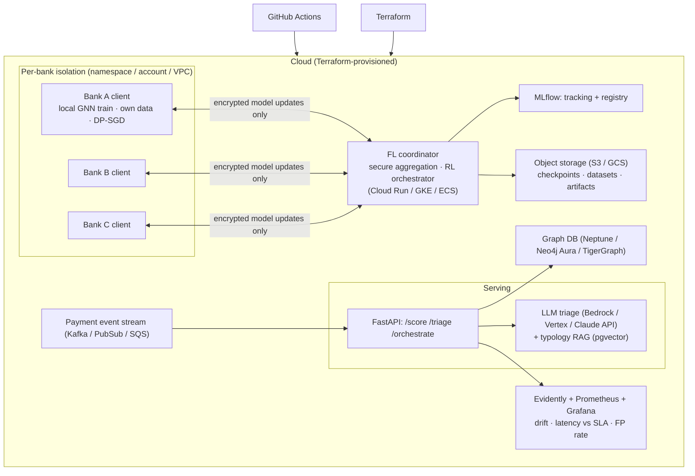

# Making it an AI · MLOps · Cloud project

Captured for later — **not yet built**. The current repo is the AI/ML core
(GNN + federated learning + RL). This is the plan to wrap it in a GenAI layer,
MLOps plumbing, and a cloud deployment that mirrors the real federated topology.

Priority order: **v0.3 problem reframing first** (payment-flow data + money-weighted
reward — see `TARGET_PROBLEM.md`), *then* this.

---

## 1. The AI layer that's missing — GenAI / LLM

Classic ML is done. The missing "AI" is an **LLM-powered investigation layer** on
top of the fraud scores — the same thing Lucinity, Hawk AI and Google's AML AI
ship.

| Component | What it does | Approach |
|---|---|---|
| **Alert-triage agent** | GNN flags a mule account → LLM takes the triggering sub-graph + account features → drafts a plain-English **Suspicious Activity Report (SAR) narrative** for a human investigator | Claude API, structured output, strict "draft only" |
| **Typology RAG** | Ground each narrative in FATF / Europol money-muling typologies ("classic fan-in/fan-out layering") | embeddings + pgvector / Chroma |
| **NL graph query** | Investigator asks *"accounts 2 hops from this victim that cashed out via crypto"* → tool-calling agent → graph query | agent over the graph DB |
| **Scenario authoring** | LLM generates realistic typology configs to drive AMLSim → richer training data | offline batch |
| **Guardrails** | LLM only drafts; a human approves every freeze/block. Every prompt+response logged for audit. | policy layer + full tracing |

---

## 2. MLOps layer

| Concern | Tool | Role in this project |
|---|---|---|
| Experiment tracking | **MLflow** (or W&B) | Log every `sweep.py` run — config, per-seed metrics, PNGs, trained GNN + RL policy as artifacts |
| Data / config versioning | **DVC** / lakeFS | Version synthetic datasets, AMLSim configs, per-bank shards; `dvc repro` reproduces a run |
| Feature store | **Feast** | Offline features for training; **online** features (velocity, age, device reuse) for real-time scoring under the deadline |
| Model registry | MLflow Registry | `staging → production`; champion/challenger between RL-orchestrated and random-selection models |
| Pipeline orchestration | **Prefect** / Dagster / Kubeflow | DAG: generate data → partition by bank → FL rounds (RL-controlled) → evaluate → gate → register; scheduled retraining |
| CI/CD for ML | **GitHub Actions** | On PR: lint, run `tests/test_autograd.py`, run a 2-seed mini-sweep, **fail if test metric drops > X**, build+push image |
| Serving | **FastAPI** + BentoML / KServe | `/score` (GNN inference), `/triage` (LLM narrative), `/orchestrate` (RL policy picks next FL round) |
| Monitoring | **Evidently** / NannyML + Prometheus / Grafana | Concept drift (fraud always drifts), scoring latency vs SLA, alert volume, false-positive rate |
| Reproducibility | Docker + pinned deps + seeds | Already seed-deterministic; add the container |

---

## 3. Cloud architecture

Design point: **each bank is a separately-isolated environment** (k8s namespace
with network policies, or separate cloud accounts) — that is what makes it a real
federated deployment, not just multiprocessing. The coordinator only ever sees
encrypted aggregates.

---

## 4. Phased plan, mapped to the repo

| Phase | Deliverable | New in repo |
|---|---|---|
| **A — Local MLOps** | MLflow in `sweep.py`; `Dockerfile`; GitHub Actions (tests + mini-sweep + metric-regression gate); DVC on datasets | `Dockerfile`, `.github/workflows/ci.yml`, `dvc.yaml`, mlflow calls |
| **B — Serving + GenAI** | `serving/` FastAPI (`/score`, `/triage` with typology RAG); Evidently drift report | `serving/`, `fedgraphrl/triage/` |
| **C — Cloud** | `infra/` Terraform: object storage, graph DB, coordinator + N bank-client containers; CI/CD deploy | `infra/` |
| **D — Real-time** | Event stream → online Feast features → real-time scoring under the deadline; RL controller as a live service | `streaming/`, Feast repo |

For a portfolio / course project: **A + B + a minimal C** (one cloud provider,
coordinator + 2 bank containers) is a strong, honest scope. Full D is production
territory.

**First commit series when we pick this up:** Phase A end-to-end — `Dockerfile`,
`docker-compose.yml` (MLflow + training job), MLflow logging in the experiment
scripts, a CI workflow running the gradcheck + a 2-seed sweep and posting metrics.
