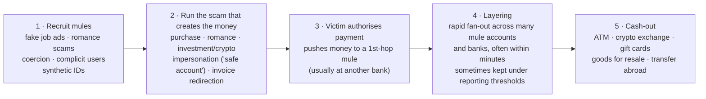

# The problem, explained simply

## 1. Explain it like I'm five

Imagine you get a message that looks **exactly** like it's from your mum:
*"I lost my phone, this is my new number — please send me £30 for the electricity bill."*
You believe it, so **you** send the money from your piggy bank.

Nobody picked your pocket. Nobody stole your card. **You pressed "send"
yourself** — because you were tricked. That's an **APP scam**: *Authorised Push
Payment*. "Authorised" = you approved it. "Push payment" = you pushed the money
out.

Now the bad guy has a problem. If the money lands in **his own** bank account,
the police can find him. So he uses **money mules** — other people's bank
accounts as stepping‑stones. Some mules are tricked too ("earn £50, just let some
money pass through your account"); some answered a fake job ad; some are in on
it.

The stolen money then **hops**:

```
you  →  mule 1  →  mule 2  →  mule 3  →  turned into cash / crypto  →  gone
```

Every hop is like passing a note around a classroom so the teacher can't tell who
started it.

### The part this project tries to solve

Each **bank** only sees **its own** customers:

- **Your bank** sees: *"our customer sent £4,000 to someone at another bank."*
  Looks normal.
- **Mule 1's bank** sees: *"our customer got £4,000 and sent it on 20 minutes
  later."* A bit odd — but not proof.

**No single bank sees the whole chain**, so no single bank is sure enough to
block it. If every bank dumped all its transactions into one big pile, the chain
would be obvious — but they're **not allowed** to share customers' private data
with each other (privacy law), and they're **competitors**.

So the trick is:

> Let every bank keep its data **at home**. Train **one shared "spotter" model**
> by passing around only the **lessons** the model learns (just numbers), never
> the customer data.

And because a suspicious payment might need to be stopped in **seconds**, there's
a **timer** on each training round. Slower banks might get skipped that round, so
a smart scheduler has to decide **who to wait for**.

That's the whole project:

> **Catch the money‑relay chain that no single bank can see — without anyone
> sharing secrets — fast enough to matter.**

The three pieces map to that sentence:
- **Graph neural network** = follows the chain of hops.
- **Federated learning** = trains without sharing data.
- **Reinforcement learning** = the scheduler deciding who trains each round under
  the timer.

---

## 2. Why *this* scam matters

| | |
|---|---|
| **It's now the biggest fraud type by value** in several countries. In the UK, APP fraud losses run to roughly **£450 million a year — over half of all payment fraud**. |
| **It bypasses card security.** Chip‑and‑PIN, 3‑D Secure, card‑network fraud checks — none of it helps, because the victim *authorised a bank transfer*, not a card payment. |
| **Instant payments make it worse.** With real‑time rails the money is cashed out before the victim realises anything is wrong. |
| **The cost moved to the banks.** UK rules (in force **7 October 2024**) make reimbursement **mandatory**, split **50/50 between the sending and receiving bank**. Banks now have a hard financial reason to detect *mule accounts* specifically — that's the receiving‑bank side. |
| **Mules are the shared weak point.** Romance scams, investment scams, ransomware, "safe account" impersonation — they *all* need mules to move the money. Disrupting mule networks hurts many crime types at once. This is why police run campaigns like Europol's **European Money Mule Action (EMMA)** and **"Don't Be a Mule"**. |

---

## 3. How the scam actually works (the lifecycle)



### What a transaction graph can see that a single row cannot

| Signal | Why it's suspicious |
|---|---|
| An account suddenly **receives from many unrelated senders** | Normal people get paid by an employer and a few contacts, not 11 strangers in a day |
| **High flow‑through**: money in ≈ money out, within minutes | A real account holds a balance; a mule is a pipe |
| **New account age** + immediate high‑value activity | Mules are opened (or bought) shortly before use |
| **Shared device / IP / phone number** across "unrelated" accounts | One operator controlling a fleet of mules |
| **Beneficiary reuse** — many mules paying the same downstream account | The cash‑out point |
| The inbound money **traces back to a reported victim** | Ground truth, but only visible if you can follow the chain across banks |

The receiving bank has the strongest signal about a mule it *didn't* onboard —
but it can't see the victim side. The sending bank sees the victim but not where
the money goes. **Federated graph learning is how you get both halves without
either bank handing over its customers.**

---

## 4. Where to get data and tools to work on it

Full annotated list: [`RESOURCES.md`](RESOURCES.md). The short version:

**Closest to this exact scenario**
- **PETs Prize Challenge (UK/US, 2022–23) — financial‑crime track.** Federated
  learning across simulated banks + a central network (SWIFT), to flag anomalous
  payments. Synthetic payment‑network dataset, task definition, and **winning
  solution write‑ups are public** (hosted on DrivenData). This is almost the
  brief in `TARGET_PROBLEM.md`.
- **Suzumura et al., "Towards Federated Graph Learning for Collaborative
  Financial Crimes Detection"** (IBM, 2019) — the same idea, on arXiv.

**Generate your own labelled payment graph**
- **AMLSim** (IBM, GitHub) — agent‑based simulator that produces a labelled
  transaction graph with configurable laundering typologies (fan‑in, fan‑out,
  cycles, stacks). Ideal for the `v0.3` payment‑flow data model.
- **PaySim** (Kaggle: *Synthetic Financial Datasets For Fraud Detection*) —
  mobile‑money simulator; `CASH_OUT` / `TRANSFER` fraud labels are mule‑flavoured.

**Ready‑made datasets**
- **IBM "Realistic Synthetic Financial Transactions for AML" (AMLworld)**,
  NeurIPS 2023 — labelled transaction graph, HI/LI variants. (Kaggle)
- **Elliptic / Elliptic++** — Bitcoin transaction graph, licit/illicit labels.
- **DGraph‑Fin** — large real‑world dynamic financial fraud graph (node
  classification).
- **IEEE‑CIS Fraud**, **Bank Account Fraud (BAF, NeurIPS 2022)** — tabular, for
  baselines and account‑opening fraud.

**Benchmarks & model code**
- **GADBench** (NeurIPS 2023) — graph‑anomaly‑detection benchmark, 29
  datasets/algorithms, one‑line to run.
- **DGFraud / DGFraud‑TF2** — toolbox of GNN fraud models (CARE‑GNN, PC‑GNN, …).
- **FedGraphNN** (FedML) — federated GNN benchmark and starter code.

**Frameworks**
- Federated: **Flower**, **NVIDIA FLARE**, **FATE** (WeBank — finance‑oriented,
  has federated GNN), **TensorFlow Federated**, **OpenFL**.
- Graph ML: **PyTorch Geometric**, **DGL**, **GraphStorm** (AWS).
- Privacy add‑ons: **Opacus** (DP‑SGD), **TenSEAL** / **PySyft**.

**Background reading (free)**
- UK Finance *Annual Fraud Report*; PSR APP‑fraud reimbursement policy documents.
- FATF and Europol money‑muling typology reports.
- *LaundroGraph* (Feedzai, ICAIF 2022); *Anti‑Money Laundering in Bitcoin* (Weber
  et al., 2019); *BWGNN / "Rethinking GNNs for Anomaly Detection"* (ICML 2022).
