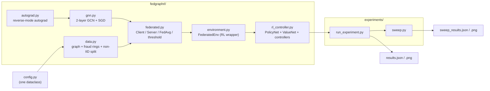

# Technical Requirements Document — FedGraph‑RL

| | |
|---|---|
| **Project** | FedGraph‑RL |
| **Type** | Research sandbox / methods study (negative‑result) |
| **Version** | 0.1.0 |
| **Status** | Complete; private pending review |
| **Owner** | Gaurav Kosare |
| **Last updated** | 2026‑08‑30 |

---

## 1. Purpose & scope

### 1.1 Problem statement

In federated learning (FL), a central server must decide **each communication
round** which subset of clients participates and how much local work each does.
The default policy is uniform‑random sampling. It is widely suspected — but rarely
cleanly tested on a graph‑structured task — that a *learned* policy could do
better by exploiting per‑client signal (data skew, staleness, loss history).

### 1.2 Objective

Build the smallest honest testbed that can answer:

> **Does a reinforcement‑learned client‑selection + compute‑allocation policy
> outperform (a) uniform‑random selection, (b) a fixed cohort, and (c) a
> fraud‑rate heuristic, on a non‑IID federated GNN fraud‑detection task —
> measured by test‑set F1/AUC across multiple graph seeds?**

### 1.3 In scope

- Synthetic transaction‑graph generation with planted fraud rings.
- Non‑IID partitioning across simulated clients.
- A GNN node classifier trainable under FedAvg.
- An RL environment wrapping the federated training loop.
- REINFORCE and actor–critic controllers.
- Heuristic baselines and a centralised upper bound.
- A multi‑seed evaluation harness with paired statistics.

### 1.4 Out of scope

- Real transaction data or any PII.
- Production serving, model registry, monitoring, CI/CD.
- Differential privacy, secure aggregation, Byzantine robustness.
- Cross‑device scale (millions of clients), asynchronous FL.
- GPU / deep‑learning‑framework acceleration.
- Being state of the art on fraud detection.

---

## 2. Stakeholders & users

| Role | Interest |
|---|---|
| ML researcher / student | Reference implementation of GNN + FL + RL in one readable codebase. |
| FL practitioner | Evidence on whether learned client selection is worth the complexity. |
| Reviewer | Reproducible numbers, clear methodology, honest reporting of a null result. |

---

## 3. Functional requirements

| ID | Requirement | Verification |
|---|---|---|
| **F‑1** | Generate a synthetic graph of `N` accounts with `R` planted fraud rings (dense intra‑ring edges + mule bridges) and a legit background graph. | `tests/test_autograd.py::test_federated_round_smoke`; inspect `make_transaction_graph`. |
| **F‑2** | Node features must contain a *weak, noisy* fraud signal (not linearly separable) plus graph‑derived signal (degree). | Centralised model F1 < 1.0 and > 0.5 (it is ~0.70). |
| **F‑3** | Partition the graph across `C` clients so fraud rings are concentrated on a minority of clients (Dirichlet α, lower = more skew). | `partition_non_iid`; per‑shard fraud rate printed by `run_experiment.py`. |
| **F‑4** | Provide a 2‑layer GCN node classifier with forward + correct backward (autograd). | `test_matmul_relu_gradcheck` (finite differences, atol 1e‑4). |
| **F‑5** | Federated client: load global weights, run `e` local epochs of class‑weighted cross‑entropy on its shard, return weights + simulated compute/comm cost. | `FederatedClient.train`; `ClientReport` fields. |
| **F‑6** | Server: compute‑weighted FedAvg; evaluate global model on train/val/test; tune the decision threshold on validation F1. | `fedavg`, `FederatedServer.evaluate`, `FederatedServer.tuned_threshold`. |
| **F‑7** | RL environment: one episode = train a fresh global GCN over `max_rounds` rounds; `step(selected, epochs)` returns `(state, reward, done, info)`. | `FederatedEnv`; smoke test. |
| **F‑8** | State = global progress (3 features) + per‑client dynamic descriptors (5 features): rounds‑since‑selected, last local loss, shard fraud rate, shard size, device speed. | `FederatedEnv._state`. |
| **F‑9** | Action = choose `k` clients without replacement (Plackett–Luce over selection logits) + split `epoch_budget` local epochs among them (softmax over budget logits). | `ReinforceController.act`. |
| **F‑10** | Reward = `ΔF1 · 100 − cost_coeff · max(0, round_cost − cost_budget)` where `cost_budget` is the auto‑calibrated cost of an average full round × slack. | `FederatedEnv.step`. |
| **F‑11** | Controller trains with episodic REINFORCE; supports (a) multi‑rollout gradient averaging, (b) scalar moving‑average baseline OR learned `V(s)` critic (actor–critic). | `ReinforceController.run_episode`, `_update`; `ValueNet`. |
| **F‑12** | Baselines: `random`, `fraud_greedy`, `all` (fixed cohort); plus a centralised (non‑federated) upper bound. | `HeuristicController`; `centralised_upper_bound`. |
| **F‑13** | Single‑seed experiment: train controller, evaluate policy (averaged over 7 sampled rollouts), compare to all baselines, write JSON + PNG. | `experiments/run_experiment.py`. |
| **F‑14** | Multi‑seed sweep: run F‑13 over `n` seeds, report per‑policy mean ± std and paired per‑seed deltas, write JSON + PNG. | `experiments/sweep.py`. |
| **F‑15** *(v0.2)* | Straggler model: heterogeneous client speeds; a selected client whose `epochs / speed` work time exceeds the per‑round deadline has its update dropped from FedAvg but still incurs compute cost. `stragglers=False` ⇒ v0.1 behaviour. | `FederatedEnv.__init__` / `.step`; `info["dropped"]`. |

---

## 4. Non‑functional requirements

| ID | Requirement | Target / rationale |
|---|---|---|
| **NF‑1 Dependencies** | NumPy only for the library; Matplotlib optional (plots only). | No CUDA, no framework — runs anywhere, reviewable line by line. |
| **NF‑2 Runtime** | Single seed ≤ 2 min; 5‑seed sweep ≤ 20 min on a laptop CPU. | Measured: ~70 s / ~12 min. |
| **NF‑3 Determinism** | Same seed ⇒ same numbers. All randomness via `np.random.default_rng(seed)`. | Enables paired comparisons. |
| **NF‑4 Reproducibility** | Every per‑seed metric persisted to JSON, not just aggregates. | `sweep_results.json`. |
| **NF‑5 Readability** | Each module < ~200 lines; the autograd engine < ~160. | Pedagogical intent. |
| **NF‑6 Honesty** | Reported results must include negative findings, variance, and the baselines that beat or tie the method. | See README §4. |
| **NF‑7 Portability** | Pure‑Python paths, POSIX + Windows. | Developed on Windows 11 + Python 3.14. |

---

## 5. System architecture



### 5.1 Key interfaces

```text
GraphData            features (N,F) · labels (N,) · adj (N,N normalised) · train/val/test masks
                     .subgraph(node_idx) -> GraphData        (re-normalised induced subgraph)

GCN.forward(features, adj, training) -> Tensor(logits (N,2))
GCN.get_weights() / .set_weights(dict)                       (for FedAvg)

FederatedClient.train(global_weights, local_epochs, seed) -> ClientReport
ClientReport         weights · num_train · local_loss · compute_cost · comm_cost

fedavg(reports, mix) -> dict                                 (sample- and compute-weighted mean)
FederatedServer.evaluate(split, threshold) -> {f1,precision,recall,accuracy,auc,threshold}
FederatedServer.tuned_threshold() -> float                   (argmax val-F1)

FederatedEnv.reset() -> state (C, 7)
FederatedEnv.step(selected (k,), epochs (k,)) -> (state, reward, done, info)

ReinforceController.act(state, greedy) -> (chosen (k,), epochs (k,), meta)
ReinforceController.run_episode(train, rollouts) -> (mean_return, info)
```

---

## 6. Data requirements

| Property | Value | Why |
|---|---|---|
| Accounts (nodes) | 1,200 | Big enough for ring structure, small enough for dense `N×N` adjacency in NumPy. |
| Node features | 16 | 3 informative (degree, weak fraud leak, high‑degree flag) + 13 noise. |
| Fraud rings | 12, size 8–22 | Overall fraud rate ≈ 0.15 (realistic class imbalance). |
| Intra‑ring edge prob. | 0.55 | Rings are dense but not cliques. |
| Legit background | Poisson degree ≈ 4 | Sparse, random. |
| Split | 60 / 20 / 20 train/val/test, node‑level random mask | Val used for threshold tuning and RL reward. |
| Non‑IID mechanism | Dirichlet(α) over clients per ring; legit nodes split ~uniformly | α = 0.10 default; α ↓ ⇒ rings pinned to fewer clients. |

No external datasets. No PII. Data regenerated from seed on every run.

---

## 7. Evaluation protocol

1. For each of 5 graph seeds `{7,107,207,307,407}`:
   a. Generate graph + non‑IID shards.
   b. Train the RL controller for `episodes` updates (`rollouts_per_update` rollouts each).
   c. Evaluate the trained policy = mean test metrics over 7 **sampled** rollouts
      (not a single greedy rollout, which is high‑variance).
   d. Run each heuristic baseline for one episode.
   e. Compute the centralised upper bound (GCN on the pooled graph).
   f. All test metrics use the **validation‑tuned** decision threshold.
2. Aggregate: per‑policy mean ± std; paired per‑seed `RL − baseline` deltas and win counts.
3. Primary metric: **F1** (class‑imbalanced). Secondary: **AUC** (threshold‑free ranking quality).

### Success criteria (defined up front)

| Outcome | Interpretation |
|---|---|
| RL beats random by > 1 std on ≥ 4/5 seeds | Positive result — learned selection helps. |
| RL within 1 std of random | **Null result — random is as good.** ← *this is what happened* |
| RL below random | RL harmed by reward shaping or optimisation. |

---

## 8. Risks & mitigations

| Risk | Mitigation | Residual |
|---|---|---|
| Hand‑written autograd has a gradient bug | Finite‑difference gradcheck in CI‑style test | Low |
| Fixed‑0.5 threshold hides real F1 | Validation‑tuned threshold for all policies | Resolved |
| REINFORCE variance masks a real effect | Multi‑rollout averaging + actor–critic; both tried | Addressed — variance is *not* the bottleneck |
| Single‑seed luck drives conclusions | 5‑seed sweep with paired stats | Low |
| Task too easy / too hard to show any signal | Difficulty tuned so centralised F1 ≈ 0.70 (headroom both ways) | Low |
| Over‑claiming a positive result | NF‑6: negative findings reported prominently | Resolved |

---

## 9. Future work (versioned)

| Version | Addition | Status | Result |
|---|---|---|---|
| 0.2 / 0.2.1 | Client stragglers + per‑round wall‑clock deadline; partial participation; REINFORCE stabilisation | **implemented** (`stragglers` etc. in `config.py`) | Instability fixed; RL +0.051 F1 vs random (3/5), +0.115 vs fixed cohort (5/5), but still ties a fraud‑rate heuristic. See README §4.2–4.3. |
| 0.3 | Payment‑flow data model + money‑weighted metrics (see `TARGET_PROBLEM.md`) | planned | Reframe onto federated mule‑account detection |
| 0.3 | Concept drift (client models decay if not retrained) | planned | Rewards *recency‑aware* scheduling |
| 0.3 | Richer state: per‑client gradient norm, embedding drift, update disagreement | More signal for the policy |
| 0.3 | GraphSAGE sampling layer (mini‑batch, scale past dense adjacency) | Larger graphs |
| 0.4 | Secure‑aggregation / DP‑SGD cost model | Realistic privacy–utility trade‑off in the reward |
