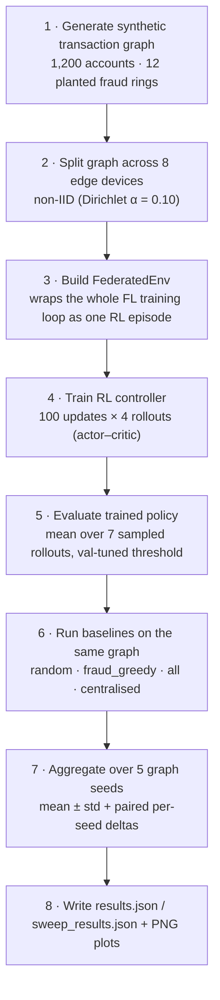
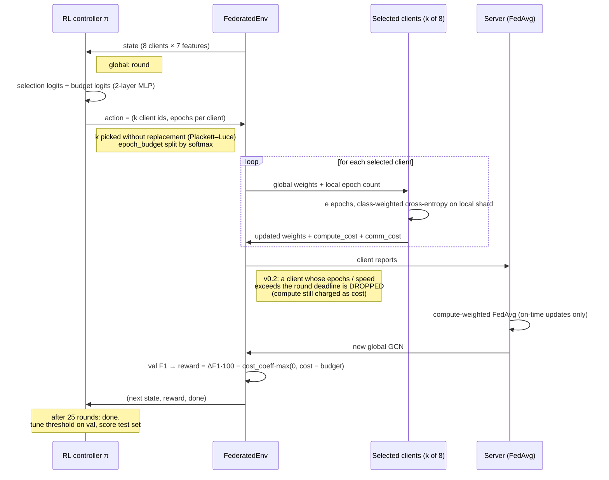
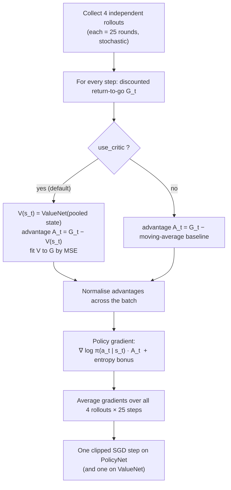
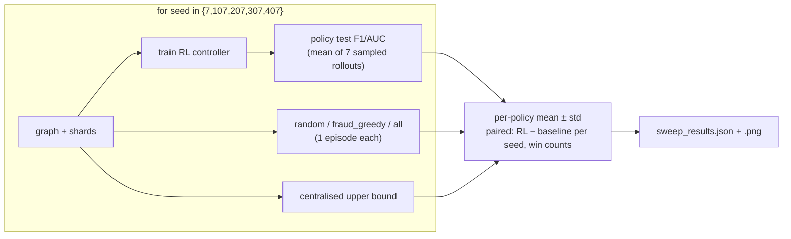

# Workflow — FedGraph‑RL

How the pieces run, end to end, with diagrams. Read alongside
[`TRD.md`](TRD.md) (what/why) and [`DESIGN_LOG.md`](DESIGN_LOG.md) (decisions).

---

## 1. The big picture



Entry points: `experiments/run_experiment.py` (steps 1–6, one seed),
`experiments/sweep.py` (steps 1–8, all seeds).

---

## 2. One federated round = one RL step



---

## 3. How the RL controller learns (one update)



**Why this shape:** a single REINFORCE trajectory through a stochastic FL run is
extremely noisy. Averaging 4 rollouts and subtracting a learned value baseline are
the two textbook variance‑reduction moves. (Result: they stabilise the *learning
curve* but do not change the *final ranking* — see DESIGN_LOG §7–8.)

---

## 4. Evaluation & aggregation



Primary metric **F1** (imbalanced classes); secondary **AUC** (threshold‑free).
All test scores use the threshold that maximises **validation** F1 for that model.

---

## 5. Developer workflow

```bash
# 1. install
python -m pip install -r requirements.txt

# 2. verify the autograd + a federated round
python tests/test_autograd.py            # prints "ok"

# 3. iterate on one seed (fast feedback, ~70 s)
python experiments/run_experiment.py
#    -> experiments/results.json, experiments/results.png

# 4. change hyper-parameters
$EDITOR fedgraphrl/config.py             # alpha, cost_coeff, episodes, use_critic, ...

# 5. full evaluation before committing a claim (~12 min)
python experiments/sweep.py 5
#    -> experiments/sweep_results.json, experiments/sweep_results.png

# 6. commit code + refreshed artifacts together
git add -A && git commit -m "..."
```

### Which knob does what (`fedgraphrl/config.py`)

| Knob | Meaning | Effect of increasing |
|---|---|---|
| `dirichlet_alpha` | non‑IID severity | ↑ = shards more IID (easier for FL, less for RL to exploit) |
| `clients_per_round` | `k` in the action | ↑ = more coverage per round, more cost |
| `epoch_budget` | total local epochs to split each round | ↑ = more local work, faster convergence, more cost |
| `cost_coeff` | overshoot penalty weight | ↑ = agent punished harder for exceeding the round budget |
| `episodes` | RL updates per seed | ↑ = more training (also more drift with plain REINFORCE) |
| `rollouts_per_update` | trajectories averaged per update | ↑ = lower‑variance gradient, linearly more compute |
| `use_critic` | learned `V(s)` vs moving‑average baseline | actor–critic on/off |
| `stragglers` *(v0.2)* | heterogeneous device speeds + deadline; late updates dropped | on = timing matters; the policy sees device speed |
| `straggler_frac` / `straggler_slowdown` | how many clients are slow, and by how much | ↑ = more/worse stragglers to route around |
| `deadline_slack` | round deadline ÷ a fast client's fair‑share time | ↓ = tighter deadline, more drops |
